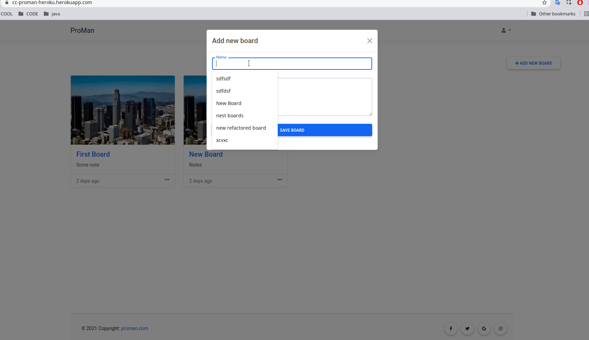
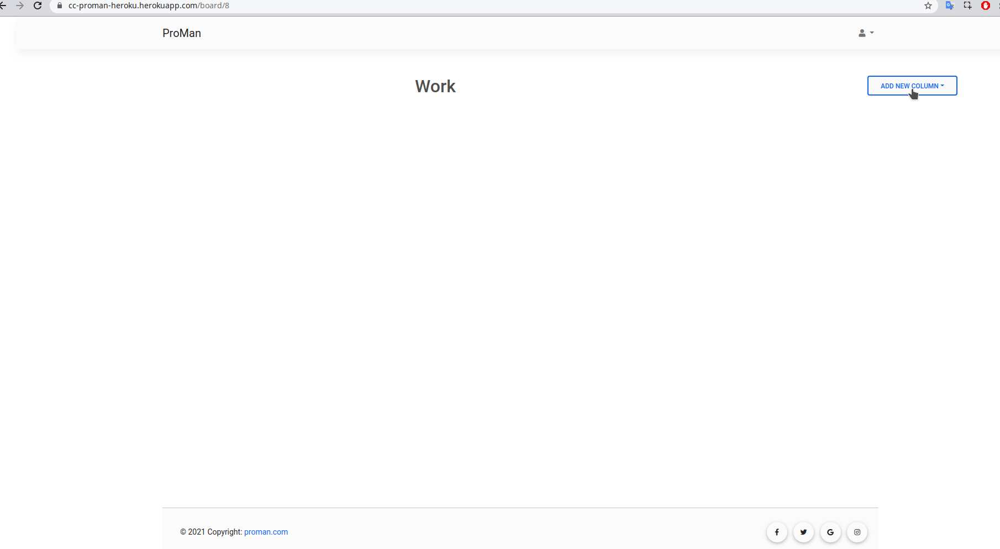
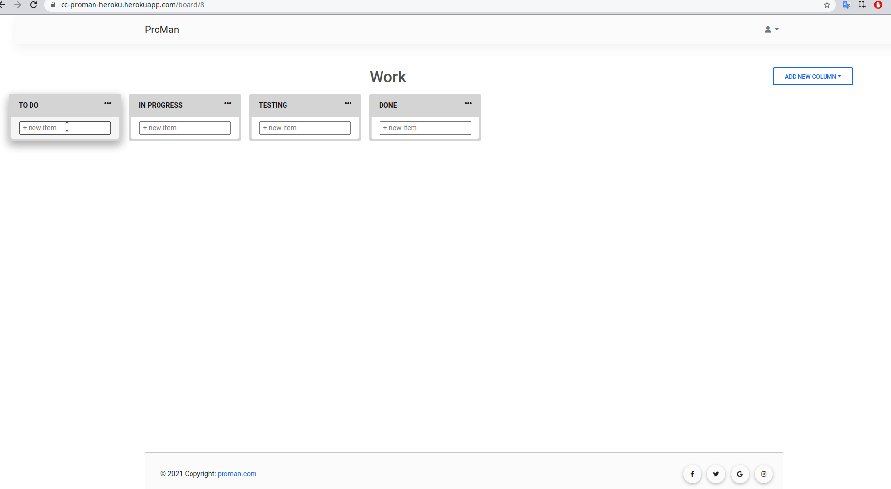
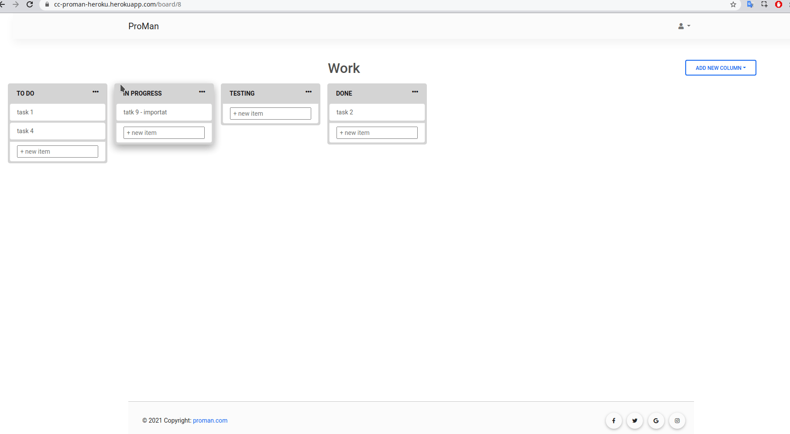

# ProMan

## Description

This is a project management tool similar to Trello. You can make boards with columns and cards to manage your tasks.

## Implemented

- Create boards
- Add card
- Add columns
- Delete
- Rename everything
- Drag and Drop cards
- Login and Registration system
- Private boards
- Postgress DB 

#### Create new board

#### Add new columns

#### Add cards to column

#### Manipulate columns

## Technologies

- Flask
- JavaScript
- Ajax
- HTML
- Postgresql
- MDB (Bootstrap)

## Live

https://ccproman.herokuapp.com/
user: demo@demo.com
pass: Demo1234
